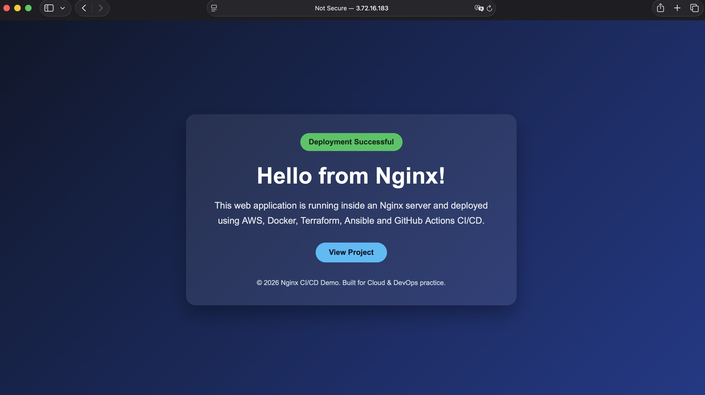
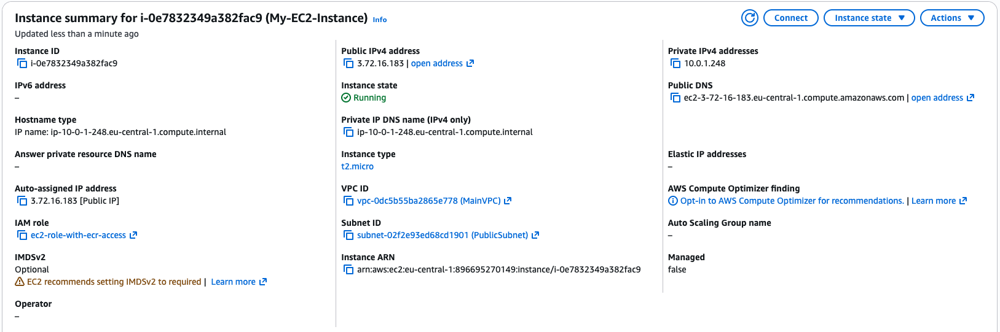

# AWS EC2 Docker CI/CD with Terraform, GitHub Actions, ECR, and Ansible

This project is an improved version of the previous project: [01-aws-ec2-docker-cicd](https://github.com/useruser300/01-aws-ec2-docker-cicd)

The previous repository contains the basic blueprint of the project, where Terraform was used to create the AWS infrastructure, Docker was used to build the application image, Amazon ECR was used to store the image, and GitHub Actions was used to deploy the application to EC2.

In this version, the project has been improved by separating the pipeline into clear stages and by adding Ansible to handle the deployment process on the EC2 instance.

The main improvement is moving from one combined workflow into a cleaner structure:

```text
Infrastructure → CI → CD → Ansible Deployment
```

---

## Project Idea

This project deploys a Dockerized Nginx application on AWS EC2.

It uses:

- Terraform to provision AWS infrastructure
- Docker to build the application image
- Amazon ECR to store Docker images
- GitHub Actions to run CI/CD workflows
- Ansible to deploy the container on EC2

The goal of this stage is to make the project more structured and closer to a real-world DevOps workflow.

---

## 1. Infrastructure Workflow

File:

```text
.github/workflows/infrastructure.yml
```

This workflow is responsible for provisioning and managing the AWS infrastructure using Terraform.

It runs when Terraform files change:

```text
*.tf
terraform.tfvars
```

It performs:

```text
terraform init
terraform plan
terraform apply
```

It can also be triggered manually to run:

```text
terraform destroy
```

This workflow manages AWS resources such as:

- EC2
- ECR
- VPC
- Security Group
- IAM

---

## 2. CI Workflow

File:

```text
.github/workflows/ci.yml
```

This workflow is responsible for building and pushing the Docker image to Amazon ECR.

It runs when application files change, such as:

```text
Dockerfile
*.html
*.css
*.js
*.conf
```

It performs:

```text
docker build
docker push
```

Each Docker image is pushed with two tags:

```text
commit-sha
latest
```

The `commit-sha` tag represents a specific version of the application, while `latest` represents the most recent image.

---

## 3. CD Workflow

File:

```text
.github/workflows/cd.yml
```

This workflow is responsible for deploying the application to EC2.

It runs automatically after the CI workflow completes successfully.

It can also be triggered manually with a specific image tag.

By default, it deploys:

```text
latest
```

The CD workflow:

```text
Reads EC2 and ECR information from Terraform outputs
Prepares the SSH key
Creates an Ansible inventory file
Runs the Ansible playbook
Prints the application URL
```

---

## 4. Ansible Deployment

File:

```text
ansible/deploy.yml
```

The Ansible playbook connects to the EC2 instance and deploys the Docker container.

It performs:

```text
Install Docker
Start Docker
Login to Amazon ECR
Pull the Docker image
Stop the old container
Remove the old container
Run the new container
```

The container runs with:

```text
Container name: my-nginx-app
Host port: 80
Container port: 80
```

---

## Deployment Flow

### First Deployment

For the first deployment, the infrastructure must be created before building and deploying the application.

```text
infrastructure.yml
→ manually run ci.yml
→ cd.yml runs automatically
```

Explanation:

```text
Terraform creates AWS resources
CI builds and pushes the Docker image to ECR
CD runs Ansible to deploy the container to EC2
```

---

### Application Change

When application files are changed, such as `index.html` or `Dockerfile`, the flow is:

```text
ci.yml
→ cd.yml
```

A new Docker image is built, pushed to ECR, and deployed to EC2.

---

### Infrastructure Change

When Terraform files are changed, the flow is:

```text
infrastructure.yml only
```

CI/CD does not run automatically after infrastructure changes.

This is intentional because an infrastructure change does not always require a new Docker image or a new deployment.

If a deployment is needed after an infrastructure change, `cd.yml` can be triggered manually with:

```text
image_tag = latest
```

---

### Destroy Infrastructure

To destroy the infrastructure, run the `infrastructure.yml` workflow manually and choose:

```text
destroy
```

---

## Final Workflow Summary

```text
First Deployment:
infrastructure → manual ci → automatic cd

Application Change:
ci → cd

Infrastructure Change:
infrastructure only

Manual Deploy:
cd with image_tag=latest

Destroy:
infrastructure destroy
```

---

## Screenshots

### Application Running on EC2

The Nginx application successfully deployed and is accessible through the EC2 public IP.



### EC2 Instance Created by Terraform

The EC2 instance was provisioned by Terraform and is used as the deployment target.



---

## Required GitHub Secrets

The following GitHub repository secrets are required:

```text
AWS_ACCESS_KEY_ID
AWS_SECRET_ACCESS_KEY
EC2_PRIVATE_KEY
```

---

## Notes

This project is built for learning and portfolio purposes.

The current design separates responsibilities clearly:

```text
Terraform = Infrastructure
CI = Build and Push Docker Image
CD = Deployment Trigger
Ansible = Server Configuration and Container Deployment
```

This makes the project easier to understand, maintain, and extend in future stages.
